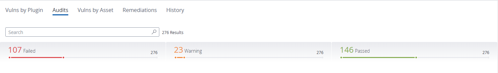
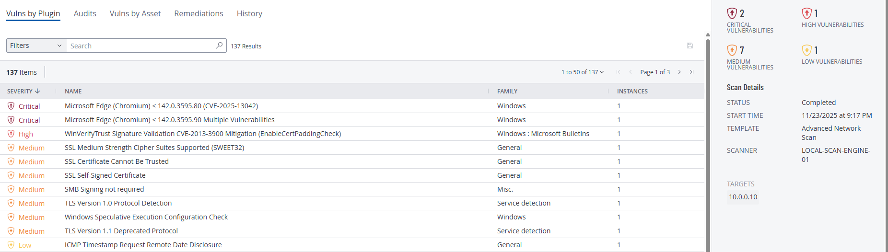
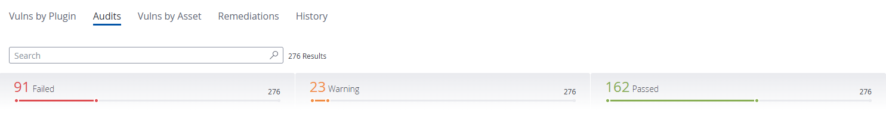
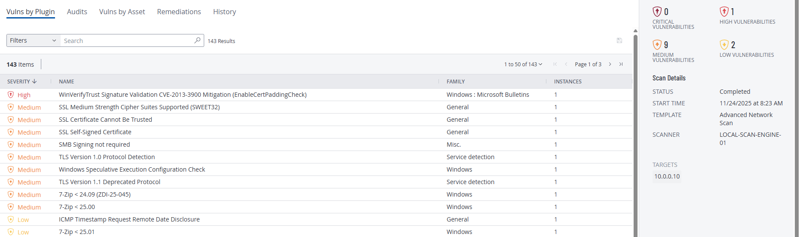
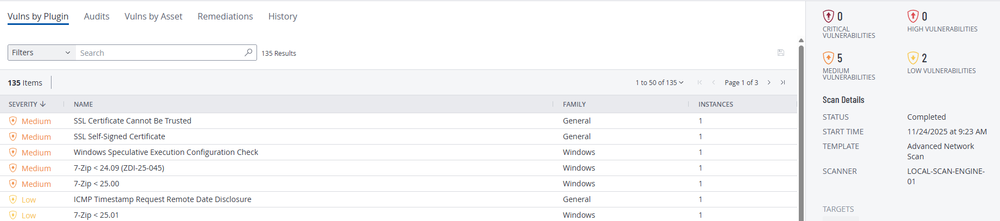

# Windows Server 2019 STIG + Nessus Remediation Lab

This lab walks through hardening a Windows Server 2019 Datacenter host with:

- DISA Windows Server 2019 STIG checks
- Tenable Nessus / Tenable Vulnerability Management scans
- PowerShell remediation scripts for both STIG findings and traditional vulnerabilities

The goal is to show an end-to-end workflow:

1. Baseline scan of an unhardened Windows Server 2019 VM  
2. Programmatic STIG remediation with PowerShell  
3. Programmatic vulnerability remediation with PowerShell  
4. Follow-up scans to verify risk reduction  

---

## Lab goals

- Practice reading and interpreting Tenable scan results  
- Map Tenable findings to DISA STIG controls  
- Write repeatable PowerShell scripts to enforce those controls  
- Re-scan and confirm that findings are closed  
- Capture evidence (screenshots + PDF reports)

---

## Environment

- **Target OS:** Windows Server 2019 Datacenter (Gen 2)  
- **Scanner:** Tenable Vulnerability Management (local scan engine)  
- **Scan template:** `Advanced Network Scan`  
- **Authentication:** Authenticated Windows credentialed scan  
- **Focus areas:**
  - DISA Microsoft Windows Server 2019 STIG v3r5
  - Medium / Low Nessus plugin findings that can be fixed with configuration changes

Key folders in this repo:

- `./evidence/scans` – PDF exports of each Tenable scan  
- `./evidence/screenshots` – before / after Nessus dashboard screenshots  
- `./evidence/scripts/stig` – PowerShell scripts targeting STIG findings  
- `./evidence/scripts/vuln` – PowerShell scripts targeting non-STIG vulnerabilities  

---

## Scan timeline and results

I ran three separate scans to clearly show progress over time.

### Scan 1 – Baseline

**Purpose**

Capture the starting point with no hardening and no custom scripts applied.

**Highlights**

- Multiple DISA STIG checks failing for:
  - Account and password policies  
  - Windows auditing configuration  
  - Event log sizes  
- One high-severity vulnerability and several medium findings  
- Weak account policies and limited audit coverage  

**Evidence**

**Screenshots**

- Audits summary  
  

- Vulns by plugin  
  

**Report**

- [Scan 1 full PDF report](./evidence/scans/scan1_intial.pdf)

---

### Scan 2 – After STIG remediation scripts

**Purpose**

Harden the OS using PowerShell and re-scan to confirm STIG coverage improved.

**Scope**

This phase focuses on:

- Account / password / lockout policy  
- Security auditing coverage  
- Minimum event log sizes for Application and Security logs  

All changes are implemented via PowerShell so they can be re-run on other servers.

**Scripts used**

- [`WN19-AC-AccountPolicies.ps1`](./evidence/scripts/stig/WN19-AC-AccountPolicies.ps1)  
  Enforces STIG-compliant password and lockout policy.

- [`WN19-AU-AuditPolicies.ps1`](./evidence/scripts/stig/WN19-AU-AuditPolicies.ps1)  
  Enables detailed security auditing for key account, logon/logoff, object access, and system events.

- [`WN19-CC-000270.ps1`](./evidence/scripts/stig/WN19-CC-000270.ps1)  
  Sets the **Application** event log size to at least 32,768 KB.

- [`WN19-CC-000280.ps1`](./evidence/scripts/stig/WN19-CC-000280.ps1)  
  Sets the **Security** event log size to at least 196,608 KB.

**Result**

- Failed audits dropped from **107** to **91**  
- Event log-related STIG checks now passing  
- Stronger password / lockout policies and much better audit coverage  
- Vulnerability counts were mostly unchanged; this phase focused on compliance rather than patching  

**Evidence**

**Screenshots**

- Audits summary  
  

- Vulns by plugin  
  

**Report**

- [Scan 2 full PDF report](./evidence/scans/scan2_post_stig.pdf)

---

### Scan 3 – After vulnerability remediation scripts

**Purpose**

Use additional PowerShell hardening scripts to remove remaining Nessus findings that are reasonable for a single lab server.

**Scope**

This phase focuses on:

- Legacy crypto and deprecated protocols  
- ICMP timestamp leakage  
- SMB signing  
- Speculative execution mitigations  
- WinVerifyTrust / certificate padding check  

**Scripts used**

- [`Crypto_Hardening_DisableLegacyProtocols_And_3DES.ps1`](./evidence/scripts/vuln/Crypto_Hardening_DisableLegacyProtocols_And_3DES.ps1)  
  Disables legacy SSL/TLS protocols (SSL 2.0 / 3.0, TLS 1.0 / 1.1) and 3DES cipher suites; enforces modern TLS only.

- [`ICMP_BlockTimestamp.ps1`](./evidence/scripts/vuln/ICMP_BlockTimestamp.ps1)  
  Blocks ICMP timestamp requests to prevent remote time disclosure.

- [`SMB_EnableSigning.ps1`](./evidence/scripts/vuln/SMB_EnableSigning.ps1)  
  Enforces SMB signing to prevent man-in-the-middle attacks on SMB sessions.

- [`SpeculativeExecution_EnableMitigations.ps1`](./evidence/scripts/vuln/SpeculativeExecution_EnableMitigations.ps1)  
  Enables Windows mitigations for speculative execution vulnerabilities.

- [`WinVerifyTrust_EnableCertPaddingCheck.ps1`](./evidence/scripts/vuln/WinVerifyTrust_EnableCertPaddingCheck.ps1)  
  Enables certificate padding check required for WinVerifyTrust hardening.

**Result**

- **0 Critical** and **0 High** vulnerabilities remaining  
- Only **5 Medium** and **2 Low** findings left  
- Failed STIG audits further reduced to **89**  
- Remaining issues are mostly non-critical or accepted for this lab (for example self-signed RDP certificate, 7-Zip upgrade)  

**Evidence**

**Screenshots**

- Audits summary  
  

- Vulns by plugin  
  

**Report**

- [Scan 3 full PDF report](./evidence/scans/scan3_final.pdf)

---

## STIG remediation table

This table summarizes the DISA STIG items remediated via PowerShell.  
Some scripts remediate multiple related STIG IDs at once.

| Script | STIG IDs Covered | Category | Description | Language | Link |
| ------ | ---------------- | -------- | ----------- | -------- | ---- |
| `WN19-AC-AccountPolicies.ps1` | `WN19-AC-000010`, `WN19-AC-000020`, `WN19-AC-000030`, `WN19-AC-000040`, `WN19-AC-000050`, `WN19-AC-000060`, `WN19-AC-000070`, `WN19-AC-000080`, `WN19-AC-000090` | AC – Account & Password Policy | Enforces account lockout duration, lockout threshold, reset counter, password history, max/min password age, minimum length, and complexity per Windows Server 2019 STIG. | PowerShell | [View remediation](./evidence/scripts/stig/WN19-AC-AccountPolicies.ps1) |
| `WN19-AU-AuditPolicies.ps1` | Key `WN19-AU-*` IDs for credential validation, account management, logon/logoff, object access, and system events; for example: `WN19-AU-000080`, `WN19-AU-000090`, `WN19-AU-000120`, `WN19-AU-000130`, `WN19-AU-000140`, `WN19-AU-000160`, `WN19-AU-000170`, `WN19-AU-000180`, `WN19-AU-000190`, `WN19-AU-000200`, `WN19-AU-000210`, `WN19-AU-000220`, `WN19-AU-000230`, `WN19-AU-000240`, `WN19-AU-000250`, `WN19-AU-000260`, `WN19-AU-000270`, `WN19-AU-000280`, `WN19-AU-000340`, `WN19-AU-000350`, `WN19-AU-000360`, `WN19-AU-000370`, `WN19-AU-000380` | AU – Auditing | Enables advanced audit policy subcategories to meet DISA requirements for account logon, account management, logon/logoff, object access, and system integrity auditing. | PowerShell | [View remediation](./evidence/scripts/stig/WN19-AU-AuditPolicies.ps1) |
| `WN19-CC-000270.ps1` | `WN19-CC-000270` | CC – Configuration | Sets **Application** event log maximum size to at least 32,768 KB. | PowerShell | [View remediation](./evidence/scripts/stig/WN19-CC-000270.ps1) |
| `WN19-CC-000280.ps1` | `WN19-CC-000280` | CC – Configuration | Sets **Security** event log maximum size to at least 196,608 KB. | PowerShell | [View remediation](./evidence/scripts/stig/WN19-CC-000280.ps1) |

> Note: The script headers in `./evidence/scripts/stig` include additional detail on registry paths and policy values that are being set.

---

## Vulnerability remediation table

This table maps Nessus plugin findings to the PowerShell scripts used to remediate them.

| Tenable Plugin / Finding | CVE(s) (where applicable) | Description | Language | Link |
| ------------------------ | ------------------------- | ----------- | -------- | ---- |
| WinVerifyTrust Signature Validation CVE-2013-3900 Mitigation (EnableCertPaddingCheck) | CVE-2013-3900 | Enables the `EnableCertPaddingCheck` setting so WinVerifyTrust enforces stricter validation of signed binaries. | PowerShell | [View remediation](./evidence/scripts/vuln/WinVerifyTrust_EnableCertPaddingCheck.ps1) |
| SSL Medium Strength Cipher Suites Supported (SWEET32), TLS Version 1.0 Protocol Detection, TLS Version 1.1 Deprecated Protocol | CVE-2016-2183 (SWEET32) and related protocol-level risks | Disables legacy SSL/TLS protocols and 3DES cipher suites; enforces modern TLS only. | PowerShell | [View remediation](./evidence/scripts/vuln/Crypto_Hardening_DisableLegacyProtocols_And_3DES.ps1) |
| ICMP Timestamp Request Remote Date Disclosure | (informational / configuration issue) | Blocks ICMP timestamp requests so the host does not leak its system time to unauthenticated clients. | PowerShell | [View remediation](./evidence/scripts/vuln/ICMP_BlockTimestamp.ps1) |
| SMB Signing not required | Mitigates man-in-the-middle attacks against SMB | Configures the OS to require SMB signing for SMB client/server communications. | PowerShell | [View remediation](./evidence/scripts/vuln/SMB_EnableSigning.ps1) |
| Windows Speculative Execution Configuration Check | Spectre / Meltdown family (for example CVE-2017-5753, CVE-2017-5715, CVE-2017-5754) | Enables registry-based mitigations required by Microsoft for speculative execution side-channel vulnerabilities. | PowerShell | [View remediation](./evidence/scripts/vuln/SpeculativeExecution_EnableMitigations.ps1) |

Additional vulnerabilities (for example older 7-Zip versions) were documented but not all were remediated via script in this lab; some were accepted for this single-VM lab environment.

---

## How to run the scripts (high level)

> **Warning:** These scripts make security-relevant changes to the OS. Always test in a lab before touching production.

1. Log into the Windows Server 2019 VM as a local administrator.

2. Copy the desired `.ps1` files onto the server.

3. Open an **elevated** PowerShell session.

4. If needed, relax the execution policy for the current session only:

        Set-ExecutionPolicy -ExecutionPolicy Bypass -Scope Process

5. Run each script you want to apply:

        .\WN19-AC-AccountPolicies.ps1
        .\WN19-AU-AuditPolicies.ps1
        .\WN19-CC-000270.ps1
        .\WN19-CC-000280.ps1

        .\Crypto_Hardening_DisableLegacyProtocols_And_3DES.ps1
        .\ICMP_BlockTimestamp.ps1
        .\SMB_EnableSigning.ps1
        .\SpeculativeExecution_EnableMitigations.ps1
        .\WinVerifyTrust_EnableCertPaddingCheck.ps1

6. Reboot when scripts indicate a restart is recommended (for example after crypto or kernel-level changes).

7. Re-run the Tenable credentialed scan and compare the results to previous scans.
